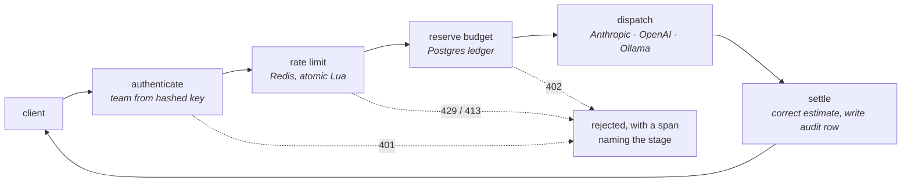

# llm-gateway

An API gateway that sits in front of every LLM call an organization makes. It
authenticates each team, enforces their rate limit and monthly budget, routes to
a provider, and records what the call cost, with a trace for every step
including the steps that reject.

**Status: one of three planned slices is built.** The proxy, the limiter, the
budget ledger and the tracing work end to end and are tested. Caching, cost
routing and provider failover are not built. [What is not built](#what-is-not-built)
lists exactly what is missing and why one of those three is now deliberate.

---

## The finding

Almost every "semantic cache" for LLM APIs works the same way: embed the
incoming prompt, look for a stored prompt that is similar enough, and if one is
found, return its saved answer without calling the model. The saving is real.
The published write-ups report a hit rate and a cost reduction.

None of them report how often the returned answer is **wrong**.

So this repo measured that first, before building the cache. The result is why
the cache in the original plan was cancelled.

Consider two prompts:

```
"What are the pros of using a monorepo?"
"What are the cons of using a monorepo?"
```

Cosine similarity: **0.9690**. One word apart, opposite answers. At any
threshold loose enough to be useful, a semantic cache answers the second
question with the first question's answer.

If you are thinking that pair was cherry-picked, it was not: the near-miss
prompts are generated from a fixed grid of templates crossed with one-word
substitutions, so the result is a property of the grid rather than of anyone's
ingenuity in finding examples. Across a workload of 80 pairs:

| Pair type | n | median similarity |
|---|---|---|
| Same question, reworded — caching is **correct** | 20 | 0.8853 |
| One token apart, different answer — caching is **wrong** | 40 | **0.9097** |
| Unrelated questions | 20 | 0.4378 |

**Pairs that must not share an answer score higher than pairs that should.** The
similarity metric ranks the cache's worst mistakes above its best hits. Eight of
the ten most-similar pairs in the workload are pairs that must never share a
cache entry.

Sweeping the threshold does not rescue it:

| Threshold | Hit rate | **Wrong answers, as a share of hits** | Correct hits caught |
|---|---|---|---|
| 0.85 | 61.3% | 71.4% | 14 of 20 |
| 0.90 | 41.2% | 75.8% | 8 of 20 |
| 0.92 | 25.0% | 70.0% | 6 of 20 |
| 0.95 | 7.5% | **100%** | **0 of 20** |
| 0.97 | 0% | never fires | 0 of 20 |

At 0.95 the cache fires six times, is wrong every time, and catches none of the
duplicates it exists for. At 0.97 it stops firing at all. There is no row on
that table worth shipping.

**Why it happens.** The word that changes the answer is short and carries little
weight: *pros/cons*, *are/are not*, *ascending/descending*, *megabytes/gigabytes*.
A sentence embedding averages it into a long, otherwise identical sentence. A
genuine paraphrase does the opposite: many words change while the meaning holds,
which pushes the vector further away. The metric measures surface overlap, and
these two cases have surface overlap inverted relative to their meaning.

That also rules out the two obvious fixes. A different threshold cannot separate
distributions that overlap completely, and a different general-purpose embedding
model optimizes the same surface-similarity objective.

Reproduce it in about a minute, no API key and no paid model:

```bash
uv run python -m bench.sweep     # writes results/cache-sweep-bge-small-en-v1.5.json
```

### What was built instead

Nothing yet, and that is the point of measuring first. The revised plan, in
order, is an exact-match cache on the normalized prompt (zero wrong answers by
construction), then a semantic candidate with a cheap verifier on the hit path.
The second one is the interesting design, and the same harness that killed the
naive version is what will measure the verifier's own error rate.

---

## Architecture



Every stage emits an OpenTelemetry span, **including the rejections**. The first
question anyone asks about a blocked request is whose limit fired, and a gateway
that returns 429 without recording that is a black box.

| Decision | Choice | Why not the obvious alternative |
|---|---|---|
| Rate limiting | Redis, single Lua script | Both the request/minute and token/minute buckets are checked in one atomic step. Two round trips would let a request rejected for its token cost still burn a request slot, charging a team twice for one rejection. |
| Connection pool | Blocking, bounded | The default pool raises once every connection is checked out, so a burst becomes a wave of 500s from the component whose job is absorbing bursts. Found by the concurrency test, not in production. |
| Budgets | Postgres, reserve then settle | This is money. A Redis counter forgets on restart. Cost is unknown until the response exists, so admission charges an estimate atomically and settlement corrects it; checking first and charging afterwards lets concurrent requests all read the same pre-spend total and all pass. |
| Money type | `Decimal` end to end | Budget enforcement decides whether a request is refused. Binary float error is not an acceptable rounding story on that path. |
| Prices | YAML config, never in code | Provider pricing changes. A stale constant silently corrupts every cost number this repo reports. |
| Providers | Vendor SDKs directly | Three providers need about a hundred lines. The value here is the control plane, not the adapters. |
| Ollama | The OpenAI adapter with a different base URL | It speaks the same protocol. A third adapter would have been a copy of the second one. |

---

## Measured

Everything below was run on this machine. Nothing is projected.

**Test suite** — `19 passed`, plus `ruff`, `ruff format` and `mypy --strict`
clean across 15 files.

**Rate limiting under real concurrency.** 14 simultaneous HTTP requests against
a team capped at 10 requests/minute:

```
10 × 200      4 × 429
```

**The limiter test has teeth.** A suite that has only ever passed proves
nothing, so the naive implementation was run against the same scenario. A
read-modify-write in Python, instead of the atomic Lua script:

```
200 of 200 granted, against a capacity of 20
```

A tenfold breach. The test catches it.

**End to end**, against a local qwen3:4b through Ollama, so no API spend:

```
POST /v1/chat/completions   →  200
x-gateway-model: qwen3:4b        x-gateway-cost-usd: 0.000000
x-ratelimit-remaining-requests: 59
```

Every rejection path was exercised against the running service: `401` on a bad
or missing key, `404` on an unknown model, `403` on a model the team is not
allowed, `503` when the provider has no credential configured, `501` on a
streaming request, `422` on a malformed body. Twelve live calls landed in the
Postgres audit trail with correct token counts, and no credential appeared in
any span.

---

## What is not built

Being specific about this is more useful than a roadmap.

| | Status |
|---|---|
| Semantic cache | **Cancelled on evidence.** See [the finding](#the-finding). Exact-match, then verifier, is the replacement. |
| Cost routing across model tiers | Not started |
| Retry, fallback, circuit breaker | Not started |
| Prometheus metrics and Grafana dashboards | Not started |
| Streaming responses | Returns an honest `501` |
| Gateway latency overhead | **Not measured.** No load test has run, so this repo quotes no overhead figure. |
| Cost savings | **Not measured**, for the same reason |

Two more things a reviewer should know:

- **The prices in `gateway.yaml` are unverified placeholders**, marked as such in
  the file. Every cost figure derives from them, so they need checking against
  provider pricing pages before any number here is quoted. The zero on the local
  model is real.
- **Budget rejection is proven by test, not in the live run.** Every live call
  used the free local model, so the cap was never approached. The concurrent
  boundary case is covered deterministically in `tests/test_ledger.py`.

### Limits of the cache finding

- 40 near-miss pairs, not the 200 originally planned. Per-axis counts are 3 to
  11, so the aggregate result holds and per-axis claims do not.
- One embedding model, `bge-small-en-v1.5`. The mechanism argues the result
  generalizes; that generalization is reasoned, not measured.
- Ground truth is true by construction rather than human labelling. Good for
  reproducibility, and real traffic will not arrive in a clean three-way split.

---

## Running it

```bash
docker compose up -d redis postgres
uv sync --extra dev

uv run ruff check . && uv run mypy app tests bench
uv run pytest tests/ -q                 # 19 passed, no API key needed

uv run python -m bench.sweep            # the cache measurement
```

To serve traffic, point it at a local model so it costs nothing:

```bash
cp .env.example .env                    # OLLAMA_BASE_URL is set by default
uv run uvicorn app.main:app --port 8077

curl localhost:8077/v1/chat/completions \
  -H 'Authorization: Bearer demo-research-key' \
  -H 'content-type: application/json' \
  -d '{"model":"qwen3-local","messages":[{"role":"user","content":"Reply with exactly: OK"}]}'
```

Postgres is published on **5433**, not 5432. If you already run Postgres
locally it holds the default port, and the resulting error reads like a
container failure rather than a port conflict, which costs more time to
diagnose than the odd port number costs to read.

## Layout

```
app/config.py     model prices and team policy, from YAML
app/limits.py     the two-bucket Lua rate limiter
app/ledger.py     spend ledger and budget enforcement
app/providers.py  vendor adapters; SDK types stop here
app/main.py       the request path
bench/workload.py the three prompt strata
bench/sweep.py    the threshold sweep
```

Statistics come from `horizon_bench.stats` in the sibling `horizon-bench`
project rather than a second copy of the Wilson interval code.
